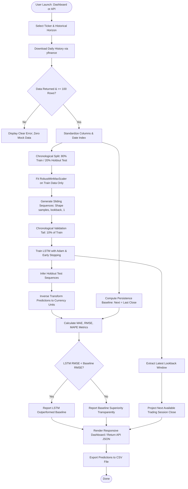
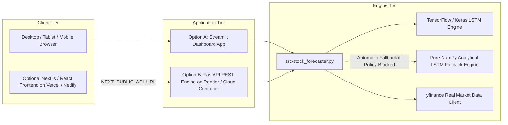

# System Architecture & Flowchart

## End-to-End Execution Flowchart

```mermaid
flowchart TD
    Start([User Launch: Dashboard or API]) --> Input[Select Ticker & Historical Horizon]
    Input --> Download[Download Daily History via yfinance]
    Download --> CheckData{Data Returned & >= 100 Rows?}
    
    CheckData -- No --> Err[Display Clear Error; Zero Mock Data]
    CheckData -- Yes --> Clean[Standardize Columns & Date Index]
    
    Clean --> Split[Chronological Split: 80% Train / 20% Holdout Test]
    Split --> Scale[Fit RobustMinMaxScaler on Train Data Only]
    Scale --> Seq[Generate Sliding Sequences: Shape samples, lookback, 1]
    
    Seq --> ValSplit[Chronological Validation Tail: 10% of Train]
    ValSplit --> TrainModel[Train LSTM with Adam & Early Stopping]
    
    TrainModel --> PredictTest[Infer Holdout Test Sequences]
    PredictTest --> Invert[Inverse Transform Predictions to Currency Units]
    
    Clean --> Base[Compute Persistence Baseline: Next = Last Close]
    
    Invert --> Eval[Calculate MAE, RMSE, MAPE Metrics]
    Base --> Eval
    
    Eval --> Compare{LSTM RMSE < Baseline RMSE?}
    Compare -- Yes --> RepGood[Report LSTM Outperformed Baseline]
    Compare -- No --> RepHonest[Report Baseline Superiority Transparently]
    
    TrainModel --> NextWindow[Extract Latest Lookback Window]
    NextWindow --> NextEst[Project Next Available Trading Session Close]
    
    RepGood --> Present[Render Responsive Dashboard / Return API JSON]
    RepHonest --> Present
    NextEst --> Present
    Present --> Export[Export Predictions to CSV File]
    Export --> End([Done])
```

## Dual-Deployment Architecture

```mermaid
flowchart LR
    subgraph Client Tier
        Browser[Desktop / Tablet / Mobile Browser]
        StaticFE[Optional Next.js / React Frontend on Vercel / Netlify]
    end

    subgraph Application Tier
        Streamlit[Option A: Streamlit Dashboard App]
        FastAPI[Option B: FastAPI REST Engine on Render / Cloud Container]
    end

    subgraph Engine Tier
        Forecaster[src/stock_forecaster.py]
        TF[TensorFlow / Keras LSTM Engine]
        NumPy[Pure NumPy Analytical LSTM Fallback Engine]
        yFin[yfinance Real Market Data Client]
    end

    Browser --> Streamlit
    StaticFE -->|NEXT_PUBLIC_API_URL| FastAPI
    Streamlit --> Forecaster
    FastAPI --> Forecaster
    Forecaster --> yFin
    Forecaster --> TF
    Forecaster -.->|Automatic Fallback if Policy-Blocked| NumPy
```
